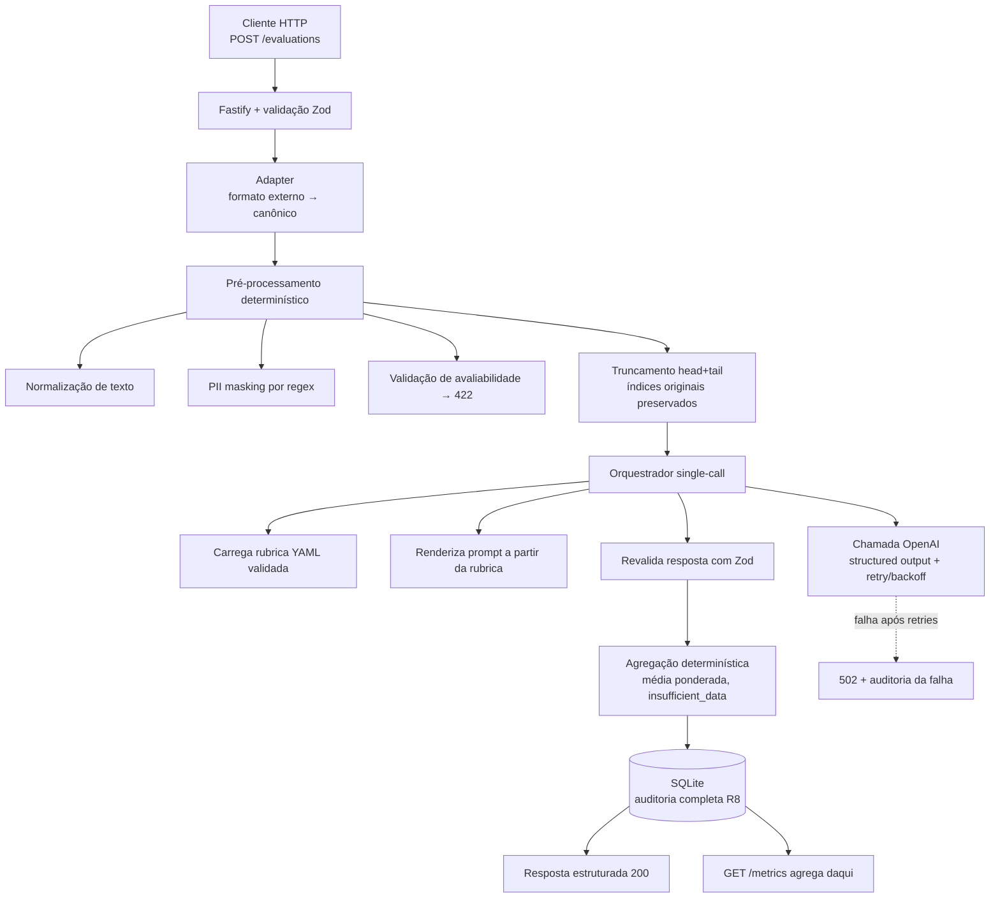

# Documento de Solução — Conversation Quality Analyzer

> Entregável 1 do teste prático de Engenheiro(a) de IA da +A Educação.
> Este documento descreve a solução, as decisões de projeto e a comparação entre
> duas abordagens arquiteturais. O protótipo funcional (Entregável 2) está neste
> repositório; o registro de uso de IA (Entregável 3) está em `AI_USAGE.md`.

---

## 1. Visão geral

O **Conversation Quality Analyzer** é uma API que avalia automaticamente a
qualidade de atendimentos em canais digitais (chat/WhatsApp). Ela recebe uma
conversa entre cliente e atendente, avalia-a com um modelo de linguagem (LLM)
atuando como **juiz** (padrão conhecido como *LLM-as-judge*) contra uma **rubrica
de critérios versionada**, e devolve uma análise estruturada: notas por dimensão
(0–5), justificativas, **evidências citadas literalmente da conversa**, nota
geral, **flags críticas** e um resumo executivo. Toda avaliação é persistida com
trilha de auditoria completa.

O objetivo de negócio é **apoiar a avaliação humana de qualidade** — não
substituí-la. Hoje esse processo é manual, caro, lento e não escala. A solução o
torna consistente, auditável e barato o suficiente para rodar sobre todo o volume
de atendimentos, entregando aos analistas de qualidade uma triagem com evidências
já destacadas, e aos gestores uma visão agregada de performance.

Embora as conversas de exemplo mostrem um atendente virtual (o bot "Beatriz"), a
solução funciona para **qualquer** conversa cliente↔atendente, humano ou IA.

### O que o sistema entrega

- **Notas por dimensão** (0–5, com âncoras descritivas), cada uma com
  justificativa e evidências (trecho literal + índice da mensagem), ou
  `insufficient_data` quando não há base para julgar.
- **Nota geral**: média ponderada determinística (dimensões sem evidência saem da
  conta e os pesos são renormalizados).
- **Flags críticas**: `hallucination`, `sensitive_data_exposure`,
  `customer_frustration`, `business_rule_violation`.
- **Resumo executivo** em português.
- **Auditoria completa** e **métricas operacionais** (custo, tokens, latência,
  distribuição de notas, flags).

---

## 2. Desenho do fluxo

O sistema é uma **pipeline síncrona em camadas**, com as dependências apontando
para dentro. Uma requisição percorre:



**Princípio central:** a rubrica é a fonte da verdade. O **prompt**, o **JSON
Schema** da saída estruturada e os **pesos** da agregação são todos derivados da
rubrica em tempo de execução. Trocar critério = editar o YAML e incrementar a
versão; **zero mudança de código**.

### Passo a passo de uma avaliação

1. **Adapter** — valida a conversa contra o contrato canônico (Zod). Um formato
   externo (ex.: o JSON de exemplo `"human: …"`/`"ai: …"`) entra por um adapter
   próprio, sem tocar no núcleo. Payload inválido → `400`.
2. **Pré-processamento determinístico** (tudo antes de gastar um token de LLM):
   normaliza o texto; **mascara PII** (CPF, telefone, e-mail, datas) por regex;
   valida **avaliabilidade** (precisa de ≥1 mensagem de cada papel com conteúdo)
   → senão `422`; e **trunca** conversas acima do limite preservando início e fim
   e os **índices originais** das mensagens.
3. **Orquestração single-call** — renderiza o prompt e o schema a partir da
   rubrica, faz **uma** chamada à OpenAI com *structured output*, e revalida a
   resposta com Zod.
4. **Agregação determinística** — a nota geral é calculada **no código** (não pelo
   LLM), por média ponderada, excluindo dimensões `insufficient_data`.
5. **Auditoria** — persiste tudo em SQLite (sucesso e falha), no caminho crítico:
   uma resposta `200` nunca é devolvida sem seu registro de auditoria.
6. **Resposta** estruturada (`200`) ou erro explícito (`400/404/422/502/500`).

---

## 3. Decisões técnicas

| Área | Decisão | Por quê |
|---|---|---|
| Stack | Node.js + TypeScript, Fastify, Zod | Tipagem forte, validação declarativa, API síncrona simples |
| LLM | OpenAI *structured outputs* (JSON Schema strict) | Garante formato; a resposta é revalidada com Zod (defesa em profundidade) |
| Rubrica | YAML versionado, validado no boot | Critérios alteráveis sem código; *fail-fast* em configuração inválida |
| Persistência | SQLite (WAL), modelo híbrido | Colunas fixas para métricas + colunas JSON para o que varia com a rubrica |
| Contagem de tokens | `tiktoken` (`o200k_base`) | Truncamento correto antes da chamada |
| Observabilidade | `pino` (logs JSON), métricas próprias | Correlation ID fim a fim; custo/latência expostos |

**Destaques de projeto:**

- **Rubrica como fonte da verdade.** `rubrics/default.v1.yaml` define 4 dimensões
  (Comunicação, Compreensão contextual, Compliance e precisão, Resolutividade),
  cada uma com peso `0.25` e âncoras 0–5, e 4 flags. O loader valida no boot que
  os pesos somam 1.0, que os ids são únicos e que as âncoras estão completas.
- **Pré-processamento determinístico e barato antes do LLM.** Rejeitar cedo
  (`422`) e mascarar PII **antes** de qualquer envio a terceiros são decisões de
  economia e de privacidade. O truncamento preserva os índices originais para que
  as evidências continuem apontando para as mensagens certas mesmo após cortar o
  meio da conversa.
- **Agregação determinística.** Tirar a média ponderada do LLM e fazê-la no código
  remove uma fonte de inconsistência e torna a nota geral reproduzível.
- **Auditoria no caminho crítico.** Cada avaliação (sucesso **e** falha) grava
  conversa original e mascarada, rubrica@versão, versão do prompt, prompt
  renderizado, resposta bruta do LLM, resultado, tokens/custo/latência/retries,
  status e correlation ID. Falha de escrita no banco → `500` (nunca um `200` sem
  auditoria).
- **Resiliência explícita.** Retry com backoff exponencial (2–3 tentativas) para
  erros transitórios; semáforo de concorrência (`LLM_MAX_CONCURRENCY`) para
  proteger a cota da OpenAI; um único re-prompt se a resposta vier fora do schema;
  esgotadas as tentativas → `502` explícito, **sem fallback silencioso**.

---

## 4. Estratégia de prompts

- **Um prompt, derivado da rubrica.** O *system prompt* é montado iterando as
  dimensões (id, nome, descrição, âncoras) e as flags da rubrica; o *user prompt*
  é a conversa com cada mensagem prefixada pelo seu índice, para o modelo poder
  **citar evidências por índice**.
- **Instruções que endereçam o domínio real** (observado nos exemplos):
  - evidências devem ser **trechos literais** com o índice da mensagem;
  - usar `insufficient_data` (nota nula) em vez de adivinhar;
  - tratar **mensagens de sistema embutidas** (ex.: prefixo `"Reposta da
    mensagem: …"`, descrições de imagem) como contexto do canal, **não** como
    falha do atendente;
  - tolerar **mojibake** (encoding quebrado) sem penalizar nem "consertar";
  - **não inventar** informação fora da conversa.
- **Idioma:** prompt em português; a rubrica é agnóstica de idioma.
- **Prompts versionados.** `PROMPT_VERSION` é persistida na auditoria, então
  avaliações antigas permanecem reproduzíveis mesmo após o prompt evoluir.
- **Baixa temperatura** para reduzir variação entre execuções.

---

## 5. Estratégia de modelos

- **`gpt-4o-mini` como padrão** (barato e rápido), com **`gpt-4o` configurável**
  por requisição (`options.model`) ou por ambiente. A troca é de um parâmetro.
- **Cálculo de custo transparente.** Uma tabela de preços por token
  (`src/config/pricing.ts`) alimenta o custo estimado, persistido na auditoria e
  exposto em `/metrics`.
- **Números reais do protótipo** (lidos de `GET /metrics` sobre as 4 conversas de
  sanidade da SPEC, com `gpt-4o-mini`):

  | Métrica | Valor |
  |---|---|
  | Custo médio por avaliação | **US$ 0,00083** (~US$ 0,0008) |
  | Tokens (média in → out) | ~2.868 → ~667 |
  | Latência p50 / p95 | **11,2 s / 17,2 s** |
  | Distribuição de notas (default@1) | Comunicação/Contexto/Resolutividade média 3,5; Compliance 4 |
  | Flags disparadas | `customer_frustration` (1 — o caso de loop) |

- **Observação de calibração (real).** No caso `S_84b564f9` (possível alucinação
  "curso mais procurado"), o `gpt-4o-mini` **não** disparou a flag `hallucination`
  para uma afirmação sutil e sem suporte. Já o caso de loop (`S_5ee36f40`) foi
  **corretamente** discriminado: notas 2 em três dimensões e a flag
  `customer_frustration`. Conclusão prática: para detecção de nuance, `gpt-4o` (ou
  um dataset dourado que calibre o modelo menor) é o caminho — sem alterar
  arquitetura, apenas configuração.

---

## 6. Estratégia de orquestração

A abordagem implementada é **single-call**: **uma única** chamada ao LLM avalia
todas as dimensões, todas as flags e o resumo, via *structured output* com o
schema completo derivado da rubrica.

- **Sem framework de orquestração.** O orquestrador é uma função TypeScript atrás
  de uma interface pequena (`conversa mascarada + rubrica → resultado`). Isso
  mantém o custo de evoluir para outra estratégia baixo, sem implementá-la agora.
- **Cliente LLM atrás de abstração fina** (`LlmClient`), o que permite o mock
  determinístico dos testes (a suíte roda **sem API key**) e a futura troca de
  provedor.
- **Por que single-call:** é **barato** (1 chamada), **rápido**, **auditável** (um
  prompt e uma resposta por avaliação) e o que **melhor escala** — avaliações são
  independentes entre si ("embaraçosamente paralelas"), então escalar é problema
  de infraestrutura, não da arquitetura de IA.

---

## 7. Comparação entre as duas abordagens arquiteturais

O teste pede a comparação de **pelo menos duas abordagens** (uma mais simples e
uma mais sofisticada). Atendemos com:

### Abordagem A — Simples (implementada): pipeline single-call LLM-as-judge

Uma chamada avalia tudo. É o protótipo deste repositório, demonstrado em tempo
real contra a OpenAI com as conversas de exemplo.

### Abordagem B — Sofisticada (analisada, não implementada): multi-agente / multi-chamadas

Uma arquitetura agêntica: **avaliadores especializados por dimensão em paralelo**
(cada um foca em um critério) **+ um juiz revisor** que critica e consolida os
pareceres (orquestrada, por exemplo, com LangGraph). Cada agente tem um prompt
mais estreito e específico.

### Comparação

| Critério | A — Single-call (implementada) | B — Multi-agente (analisada) |
|---|---|---|
| Qualidade em casos sutis | Boa; nuance depende do modelo | Potencialmente melhor (especialização + revisão) |
| Custo por avaliação | **~US$ 0,0008** (medido) | **~US$ 0,003–0,005** (estimado, 4–6×) |
| Latência | **~11–17 s** (medido) | ~20–35 s (estimado, ~2×) |
| Complexidade | Baixa (uma função) | Alta (orquestração, estado, N prompts) |
| Auditabilidade | Simples (1 prompt/1 resposta) | Mais difícil (N traços por avaliação) |
| Escalabilidade | Excelente (stateless, 1 chamada) | Pior (N× chamadas pressionam a cota) |

**Estimativa de custo da Abordagem B.** Com 4 avaliadores + 1 juiz, a conversa é
enviada ~5 vezes (cada avaliador vê o texto todo), então o custo de **input**
multiplica por ~5 e há ~5 respostas. Partindo dos ~2.868 tokens de input medidos,
o custo por avaliação sobe para a faixa de **US$ 0,003–0,005** (4–6× o
single-call), e a latência aproximadamente dobra (avaliadores em paralelo + juiz
sequencial). Os números exatos dependem do tamanho dos prompts de cada agente.

**Gatilhos que justificariam adotar a Abordagem B:**

1. Um **dataset dourado** (conversas com avaliação humana de referência) mostrar
   que o ganho de qualidade da B **supera** o custo de ~5× — a decisão vira
   quantitativa, não de intuição.
2. Casos de **alta consequência** (ex.: compliance regulatório) onde um segundo
   olhar do juiz revisor reduz erro de forma mensurável.
3. Conversas **muito longas** (ex.: transcrições de voz de horas), onde um desenho
   *map-reduce* (segmentar, avaliar por segmento, agregar por dimensão) se
   justifica naturalmente.

**Recomendação para o MVP: Abordagem A.** Ela entrega o valor central (avaliação
consistente, auditável e barata) com a menor complexidade e a melhor
escalabilidade, e foi **demonstrada com números reais**. Implementar as duas
dobraria o esforço e diluiria a qualidade do protótipo dentro do time-box.
Crucialmente, a arquitetura **não trava** a evolução: a interface pequena do
orquestrador permite plugar a Abordagem B (ou um modo *map-reduce*) sem tocar na
API nem na persistência — a adoção fica condicionada a evidência do dataset
dourado.

---

## 8. Viabilidade econômica

- **Custo por avaliação medido: ~US$ 0,0008.** Extrapolando (apenas o custo de
  LLM, `gpt-4o-mini`):

  | Volume | Custo estimado de LLM |
  |---|---|
  | 100 avaliações/dia | ~US$ 0,08/dia |
  | 1.000 avaliações/dia | ~US$ 0,83/dia (~US$ 25/mês) |
  | 100.000 avaliações/dia | ~US$ 83/dia |

  Mesmo em volumes altos, o custo de LLM é ordens de grandeza menor do que o de
  avaliação manual por analistas — o que sustenta a proposta de rodar a análise
  sobre **todo** o volume, e não por amostragem.
- **Defesas de custo já no projeto:** validação pré-LLM (`422` antes de gastar
  token), teto de tokens por conversa (truncamento), custo por avaliação visível
  em `/metrics` e alerta de orçamento diário (documentado). **Sem cache de
  respostas** — cada conversa é única, então cache não ajudaria; registramos isso
  explicitamente.

---

## 9. Escalabilidade e operação

- **A abordagem simples é a que melhor escala.** A API é *stateless* (o estado
  vive só no SQLite) e as avaliações são independentes. Escalar é um problema de
  infraestrutura, não da arquitetura de IA — nenhum degrau de escala altera o
  núcleo (rubrica → prompt → single-call → agregação → auditoria).

  | Situação | Protótipo aguenta? | Degrau de escala |
  |---|---|---|
  | Dezenas de avaliações/dia | Sim, como está | — |
  | Milhares/dia | Não (síncrono + SQLite) | Fila + workers + Postgres |
  | Picos em lote (ciclo de QA) | Não (timeouts) | A fila absorve; latência sobe, sistema não cai |
  | Rate limit da OpenAI | Parcial (retry + concorrência) | Fila regula o ritmo pela cota |
  | Queda da OpenAI | Sim (falha explícita + auditoria) | A fila reprocessa ao voltar |

- **Observabilidade / LLMOps.** O protótipo já expõe métricas próprias
  (`/metrics`: custo, tokens, latência p50/p95, distribuição de notas por
  dimensão/rubrica-versão, contagem de flags) e liveness (`/health`, com checagem
  do SQLite), com correlation ID fim a fim nos logs. Em produção, a visão de
  LLMOps inclui:
  - **Tracing dedicado de LLM** (ex.: Langfuse) por chamada;
  - **Dataset dourado** rodado como *eval* automatizado a cada mudança de
    prompt/rubrica/modelo;
  - **Concordância humano-IA** como métrica-chave; discordâncias realimentam o
    dataset dourado;
  - **Drift de notas** ao longo do tempo por rubrica-versão;
  - **Shadow evaluation**: nova versão de prompt/rubrica roda em paralelo antes de
    ser promovida (a seleção de rubrica por requisição já habilita isso).

---

## 10. Riscos, limitações e próximos passos

### Riscos e limitações assumidas

- **Consistência do LLM-as-judge.** Notas podem variar entre execuções. Mitigação:
  temperatura baixa, âncoras descritivas e escala curta (0–5); a calibração real
  exige o dataset dourado (futuro).
- **Nuance no `gpt-4o-mini`.** Como observado, alucinação sutil pode não ser
  sinalizada. Mitigação: `gpt-4o` por configuração e/ou dataset dourado.
- **PII masking por regex é melhor-esforço.** Formatos não previstos podem
  escapar; NER é o próximo passo documentado. (Nota de projeto: como a PII é
  mascarada **antes** do LLM, a própria flag `sensitive_data_exposure` fica mais
  difícil de disparar a partir do texto mascarado — uma consequência do desenho
  de privacidade, não uma falha do juiz.)
- **Dependência de um único provedor (OpenAI).** A abstração fina do cliente
  facilita a troca; multi-provider está fora do escopo.
- **Abordagem sofisticada não demonstrada em código.** Decisão deliberada de
  time-box, analisada acima; adoção condicionada a evidência de ganho.

### Próximos passos

- Autenticação (API key/OAuth) e *rate limiting* de entrada.
- Fila assíncrona (202 + webhook/polling) e workers para volume alto; Postgres
  (JSONB) + object storage para a auditoria em produção.
- Endpoints de consulta (`GET /evaluations`, `/evaluations/:id`) e batch.
- Integração Langfuse, dataset dourado e pipeline de *evals* em CI.
- PII masking com NER; dimensões `computed` (ex.: tempo de resposta via
  timestamps); adapter para transcrições de voz; *map-reduce* para conversas
  muito longas.
- Abordagem multi-agente (avaliadores por dimensão + juiz revisor), **se e quando**
  o dataset dourado justificar o custo adicional.

---

## Apêndice — Como executar

Instruções completas de execução (local e Docker), exemplo real de
requisição/resposta, seleção de rubrica/modelo e o script de demonstração estão no
[`README.md`](../README.md). Resumidamente:

```bash
npm install
cp .env.example .env          # preencher OPENAI_API_KEY
npm run dev                   # sobe a API
npm run demo -- --session S_84b564f9   # avalia uma conversa de exemplo
npm test                      # suíte completa, sem API key (122 testes)
```

As tags `v0.1-mvp` (avaliação básica fim a fim) e `v1.0` (auditoria + métricas +
truncamento + demo + Docker) marcam a evolução incremental.
